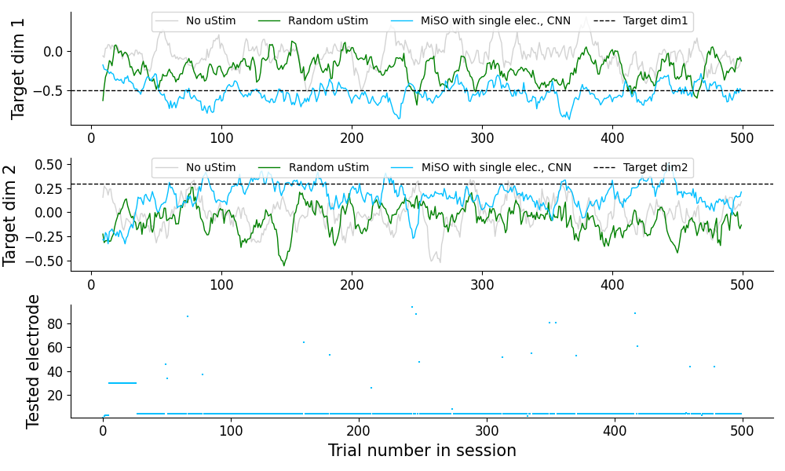

# MiSO: Optimizing brain stimulation to create neural population activity states

This repository provides an outline of the implementation of MiSO (MicroStimulation Optimization) proposed in [MiSO: Optimizing brain stimulation to create neural population activity states](https://openreview.net/pdf?id=Gb0mXhn5h3). 

## Overview
MiSO is a closed-loop brain stimulation framework to create a targeted neural population activity state. In the paper, we report closed-loop experimental results in an online experiment. While it is challenging to replicate in offline code the exact results in the paper because it involved an online experiment with neuronal population recordings, we provide an outline of this process with code that runs a simulation of a simplified version of our online experiment. 

The folder structure is as follows:
```
.
├── config                   # Config files
├── data                     # Experimental data files
│   ├── arraymap             # Array map with electrode id and location
│   ├── fr                   # Average firing rate induced by each uStim pattern
│   └── usable_channels      # Usable electrodes (see Supplementary Section S2)
├── figure                   # Output figures
├── model                    # Trained models
│   ├── cnn                  # Trained CNN models
│   └── fa                   # Trained FA models
├── output                   # Output files generated by each code
│   ├── binned_spike_cnt     # Binned spike counts
│   ├── cnn_prediction       # CNN predictions for all uStim patterns
│   └── cnn_training_data    # CNN training data
├── py                       # Python files to run MiSO
├── LICENSE
└── README.md
```

## Requirements

Installation requirements:

```
conda env create -f environment.yml
conda activate MiSO
```

## Execution

To run a simulation of a closed-loop stimulation experiment using MiSO (with single electrodes and CNN predictions initialization), run this command:

```
python py/main.py
```

This code executes the following 8 steps:
1. Generate binned spike count data for a reference session, which involves only no uStim trials
2. Fit a Factor Analysis (FA) model to the reference session data to define a reference latent subspace $\Lambda_0$
3. Generate binned spike count data for the training sessions, which involves both no uStim and uStim trials
4. Fit FA models for each training session to obtain each session's subspace 
5. Align latent subspace $\Lambda_i$ to $\Lambda_0$, obtaining the aligned latent subspace $\hat{\Lambda}_i$ and create a merged training data set from all aligned sessions
6. Train a CNN model to obtain uStim response predictions for all 96 single electrodes
7. Run a closed-loop optimization session with MiSO initialized with the CNN predictions 
8. Visualize the closed-loop performance of MiSO and other baselines in the same format as Fig. 2A


## Evaluation

main.py outputs a figure saved in /figure folder. Below is an example of the figure generated with the same format as Fig. 2A in the paper. 


Note that this code package is not intended to replicate the exact results in the paper, which features a real closed-loop experiment with an animal. To simulate a closed-loop experiment, we generated fake spiking data using a Poisson process with a mean chosen based on the average firing rates of each neuron computed from the real data. Depending on the random seed, MiSO could perform equally or underperform the baselines, because of this noisy independent spike generation process (see the next section for more details).

## Simplification made in this implementation
To enable running the entire simulation on a CPU, we made several simplifications in this implementation.
- Poisson process based spike count generation
  - In this code, we used a Poisson process to generate noisy spiking activity as found in the brain. A Poisson process generates spiking activity independently for each neuron, whereas a population of real neurons covary together. Therefore, the generated spike count data should not in principle contain shared covariance structure between neurons, making the optimal dimensionality identified by Factor Analysis (FA) equal to 0. However, to demonstrate how MiSO works, we forced the FA model to identify a four dimensional space using the generated spike count data. This could lead to differences in performance compared to the results presented in the paper (e.g., cases where MiSO underperforms the two other baselines).
- Single electrode uStim patterns, but not double electrodes
  - While we validated MiSO with double electrode uStim patterns, this code only supports single electrode uStim patterns, given that in this case we can provide the data for the expected firing rates induced by all uStim patterns. The large number of all double electrode uStim patterns (4,560 patterns) made it challenging to prepare the same kind of dataset. 
- No guided sampling, which requires multiple CNN training runs
  - MiSO involves two phases to collect the CNN training data (Section 2.4). However, to enable running the simulation on a CPU machine within a short time, this code only performs the first phase with random stimulation pattern selection (Section 2.4.1). 
- No bagging, which requires training multiple CNNs
  - MiSO uses bagging to stabilize the CNN predictions. This requires training 50 CNN models. We removed this computationally expensive process from this code and trained just one CNN using all training data.
- No clipped learning rate
  - While MiSO uses a clipped learning rate, this code uses a fixed learning rate throughout a session to simplify the implementation.

## Contact
For questions, please contact Yuki Minai at yminai@andrew.cmu.edu.

## Acknowledgements
The code to fit the FA model (under ./py/util/fa/) was cloned from [this repository](https://github.com/akash-uma/fa/tree/master) by Akash Umakantha.

## Licence
Shield: [![CC BY-NC-ND 4.0][cc-by-nc-nd-shield]][cc-by-nc-nd]

This work is licensed under a
[Creative Commons Attribution-NonCommercial-NoDerivs 4.0 International License][cc-by-nc-nd].

[![CC BY-NC-ND 4.0][cc-by-nc-nd-image]][cc-by-nc-nd]

[cc-by-nc-nd]: http://creativecommons.org/licenses/by-nc-nd/4.0/
[cc-by-nc-nd-image]: https://licensebuttons.net/l/by-nc-nd/4.0/88x31.png
[cc-by-nc-nd-shield]: https://img.shields.io/badge/License-CC%20BY--NC--ND%204.0-lightgrey.svg
